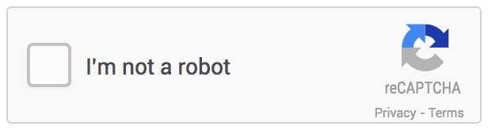
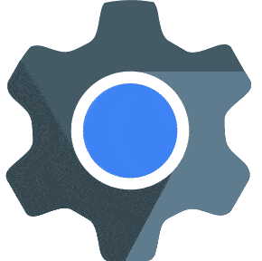

<strong>

    ➯ Please confirm you are not a robot before continue 🤖

 
 

    ➯ You can go now! ✅

 
</strong>

 
 
"The life is <strong>hard</strong>, but my <strong>dick</strong> is more." - Aristotle, 3<strong>69</strong> a.c.

**➯ Something about me ❤️**

-  Currently studying
  **TypeScript**;

-  **Brazilian** resident;

-  My cake day is **04/05**;

-  I wanna learn
   and
   =]

**➯ My Skills 🎯**

<code></code>
<code></code>
<code></code>
<code></code>
<code></code>
<code></code>
<code></code>
<code></code>
<code></code>

**➯ My Tools **

<code></code>
<code></code>

    
<strong>My Statistics </strong>

 

<code></code>
<code></code>

 
 

<a href="https://twitter.com/Sunf3r">
<code></code></a>
<a href="https://discord.com/users/568493382884917258">
<code></code></a>
<code></code>