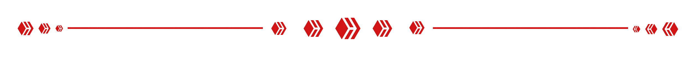

    
     
     
    "The life is hard, but my dick is more." - Aristotle, 369 a.c.

**➯ Something about me ❤️:**

-  Currently studying
  TypeScript;

-  Brazilian resident;

-  My cake day is 04/05;

- ❤️ I wanna learn
   and
   =];

**➯ My Skills 🎯**

<code></code>
<code></code>
<code></code>
<code></code>
<code></code>
<code></code>
<code></code>
<code></code>
<code></code>

**➯ My tools 🔧**

<code></code>
<code></code>

    
<strong>My Statistics 🚀</strong>

 
 

<a href="https://twitter.com/Sunf3r">
<code></code></a>
<a href="https://discord.com/users/568493382884917258">
<code></code></a>

